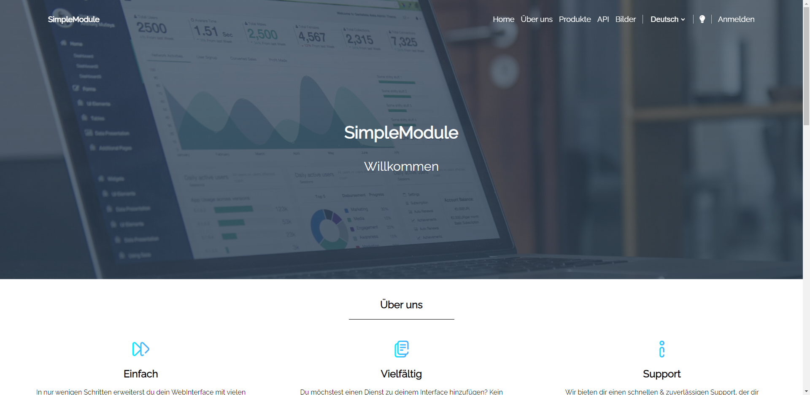
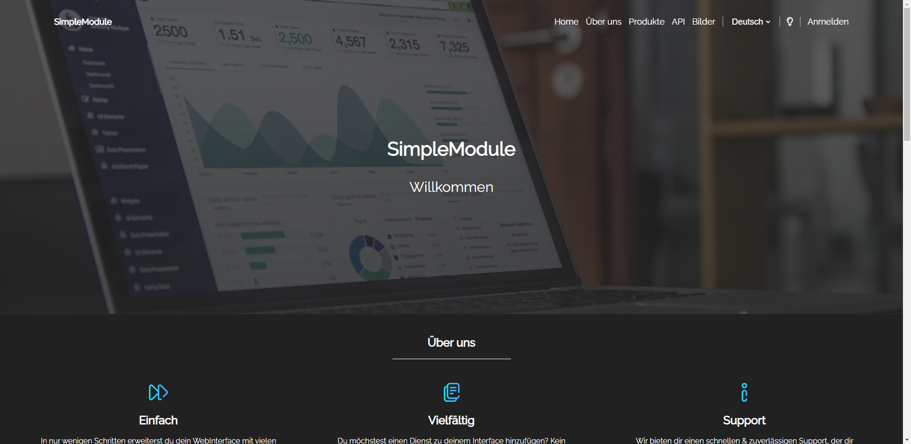
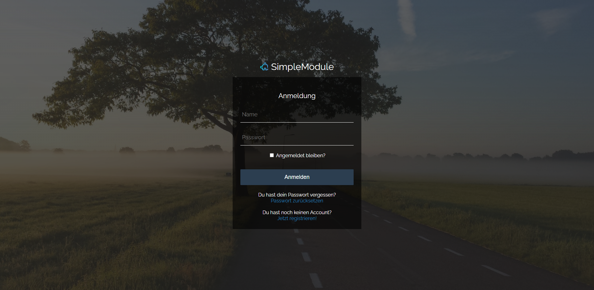
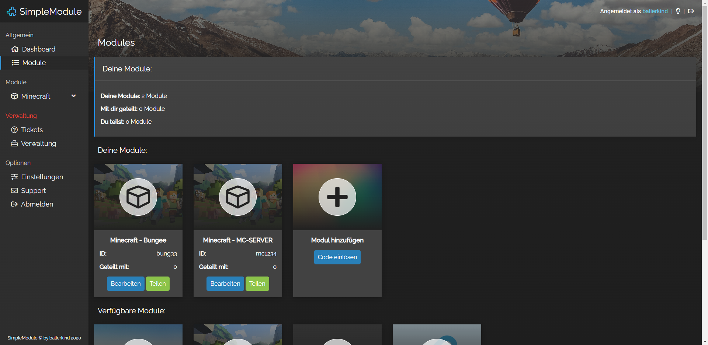
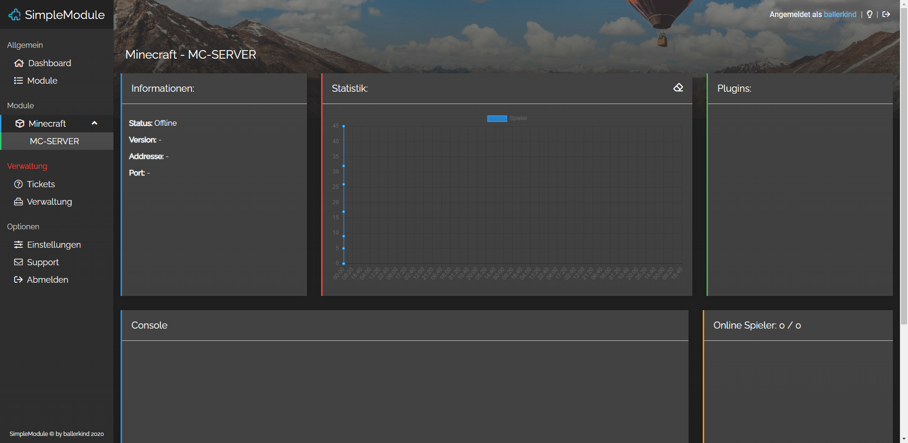
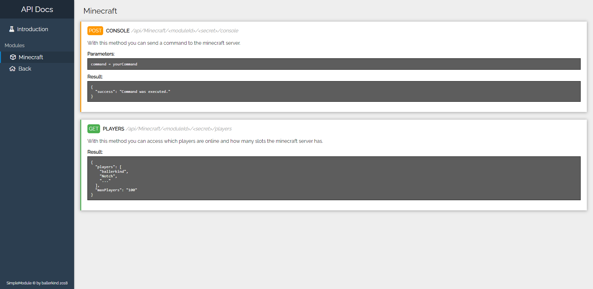

# SimpleModule
SimpleModule is a modular interface that allows the control of different services from a single website

## Screenshots:
### Welcome (Light mode)

### Welcome (Dark mode)

### Login

### Module Overview

### Minecraft Module

### API

